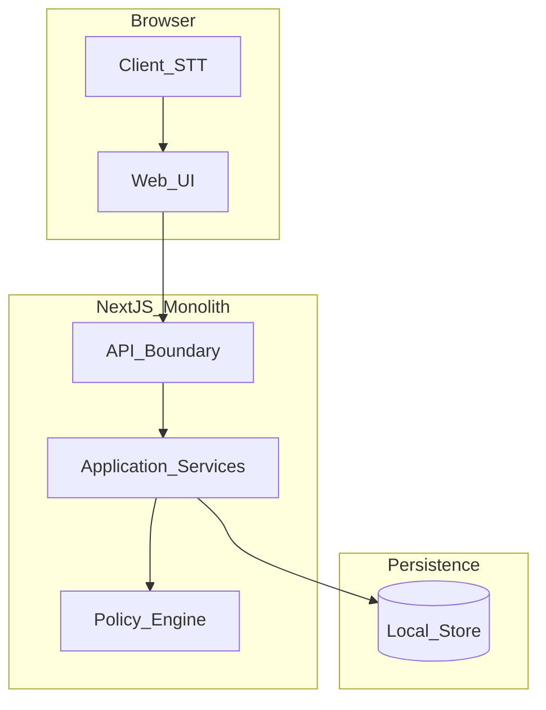

# Logical Components - monolith-core (PoC)

## 1. 目的

物理インフラの詳細（VPC、マシンサイズ等）は対象外とし、**論理ブロック**とその責務・接続を定義する。NFR は「単一デプロイ・軽量永続・最小観測性」を前提とする。

## 2. 論理構成（テキスト）

```text
[利用者ブラウザ]
    │ HTTPS
    ▼
+---------------------------+
| Next.js モノリス         |
|  - 画面（投稿/ダッシュ/通知/管理） |
|  - /v1/api/* Route Handlers 等   |
|  - ドメインサービス（Message/Topic/Analysis/Notification/Policy） |
+---------------------------+
    │
    ▼
+---------------------------+
| 永続ストア（単一）        |
|  PoC: ファイル or 軽量DB   |
+---------------------------+

任意（ブラウザ外）:
  - ブラウザ組み込み STT（クライアント側）
  - 将来: /v1/api/voice/transcribe 経由の外部 STT
```

## 3. 論理コンポーネント一覧

| 論理コンポーネント | 責務 | PoC での備考 |
|--------------------|------|----------------|
| **Web クライアント** | UI 表示、入力、クライアント側 STT、API 呼び出し | 投稿者は通知 UI を持たない（閲覧者・管理者のみ） |
| **HTTP API 境界** | 認可、リクエスト検証、HTTP ステータス整形 | プレフィックス `/v1/api/...` |
| **アプリケーションロジック** | ユースケース調停、トランザクション境界 | 投稿〜通知まで同期・同一単位 |
| **Content Policy Engine** | 入力検証・マスキング・NG 時の補正方針 | Functional Design と一致 |
| **永続ストア** | Topic/Message/Notification 等の保持 | CSV/JSON または単一 DB ファイル想定を許容 |
| **分析ロジック** | 集計・改善提案生成（PoC 範囲） | 重い非同期基盤は置かない |
| **通知ストア** | アプリ内通知レコード | 即時生成、外部チャネルなし |

## 4. 明示的に置かない論理コンポーネント

| 論理コンポーネント | 理由 |
|--------------------|------|
| メッセージキュー | 非同期分離は PoC スコープ外 |
| 分散キャッシュ | 必須としない |
| 全文検索エンジン | 不要 |
| ログ集約基盤（ELK 等） | 運用監視本格化は対象外 |
| API ゲートウェイ（独立） | モノリス内で完結 |

## 5. 参照図（Mermaid）



**テキスト代替**: ブラウザの UI が API 境界を呼び出し、アプリケーションサービスが Policy と永続ストアにアクセスする。STT は主にブラウザ内で UI に入力を渡す。

## 6. 外部依存（任意）

| 依存 | 必須 | 備考 |
|------|------|------|
| ブラウザ STT | PoC 優先 | `tech-stack-decisions.md` に準拠 |
| サーバ経由 STT API | 任意 | 利用する場合のみ環境変数でキー管理 |
| LLM / 外部 AI | 任意 | 分析・提案に使う場合のみ。失敗時はルールベースへ寄せうる |
