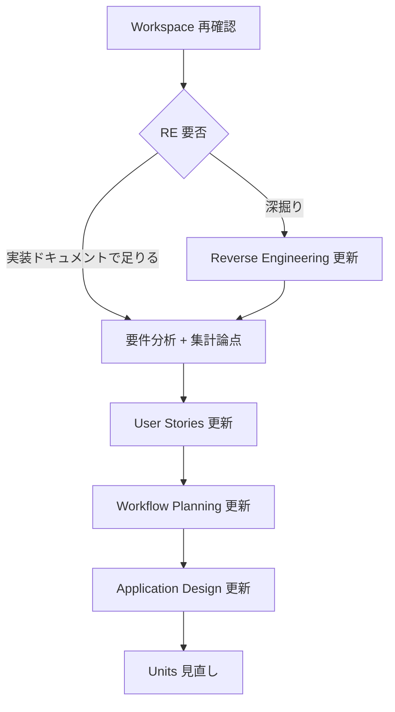

# Inception フル再見直し計画

**状態**: **承認済み**（計画 **2026-05-10** 承認。集計論点メモ同時承認 — 以降はチェックリストに従い残項目を消化）  
**きっかけ**: プロダクト方針の再確認に加え、**同一人物の連投・重複投稿が集計に与える影響**を要件として追加検討する。  
**既存成果物**: これまでの Inception／Construction 成果は **ベースライン** として保持する。再見直しで差し替え・追認した内容のみを正とする。

---

## 1. 目的

- AI-DLC の Inception を **最初から順に**見直し、前提・スコープ・トレーサビリティを再確認する。
- **集計の歪み**（連投・重複・同一投稿者の識別可能性）について、PoC と本番の切り分け、プライバシー、実装コストを整理し、**意思決定可能な形**で文書化する。

---

## 2. 推奨実行順（チェックリスト）

再見直しでは、各段階で **「現状のドキュメントを読む → 変更要否 → 承認」** を繰り返す。

- [x] **1. Workspace Detection の再確認**  
  - ブラウンフィールド／グリーンフィールド、コードの所在、`aidlc-docs/` の役割。  
  - 正: `aidlc-state.md` の Workspace 行、`AGENTS.md` のディレクトリ規約。

- [x] **2. Reverse Engineering**  
  - 本リポジトリは **ブラウンフィールド**（実装あり）。差分が大きい場合のみ、リバースエンジニアリング成果の更新を検討。  
  - *現状*: 専用の `reverse-engineering/` フォルダが無い場合は **スキップ可**（計画に「実装読み取りで代替」と記録）。

- [x] **3. Requirements Analysis（追加論点の取り込み）**  
  - 正: `inception/requirements/requirement-verification-questions.md`、`service-proposal-monku-box.md`。  
  - **必須**: `inception/requirements/aggregation-duplicate-and-repeat-submissions.md` を読み、設問に回答し、必要なら要件確認書へ追記または改訂版を起票。  
  - 拡張（Security Baseline 等）の再オプトインは、要件分析の節に従い **明示的に実施するか記録でスキップ**。

- [x] **4. User Stories**  
  - `stories.md`・`personas.md`・`unit-of-work-story-map.md` を、上記要件の結論に合わせて更新（例: 集計の定義、重複扱い、管理者向け表示）。  
  - 受け入れ基準の `[x]` は **再検証** し、変わった項は `[ ]` に戻すか、注記を付ける。

- [x] **5. Workflow Planning**  
  - `workflow-plan-monku-box-poc.md` を更新、または **再見直し版** を別ファイルで起票。Construction に戻す範囲（パッチのみ／NFR 見直し／データモデル変更）を明記。

- [x] **6. Application Design**  
  - `application-design.md` に **集計の定義**（生メッセージ件数 vs 重複除外後など）、**同一投稿者の識別子方針**、ダッシュボード／分析の境界を追記。

- [x] **7. Units Generation（条件付き）**  
  - 単一ユニットのままか、分析・Policy・API を分割するか。`unit-of-work.md` を更新。

各段階完了時に **`aidlc-docs/aidlc-state.md`** の「Inception 再見直し」表を更新し、**`audit.md` にユーザー承認または指示の生ログ**を残す。

---

## 3. 新規論点（必読）

| 資料 | 内容 |
|------|------|
| `inception/requirements/aggregation-duplicate-and-repeat-submissions.md` | 連投・重複・同一人物と集計の懸念、現行実装の事実、選択肢、設問と `[Answer]:` |

本計画の **3. Requirements Analysis** は、`aggregation-duplicate-and-repeat-submissions.md` の **§6 回答・承認（2026-05-10）** をもって完了とする。

---

## 4. フロー（参照）

---

## 5. 承認

- **計画起票**: 2026-05-10  
- **承認**: **2026-05-10**（集計・連投・重複の要件メモ回答とあわせてユーザー承認）  
- **User Input**: `audit.md`「集計論点・計画の承認」エントリを参照
